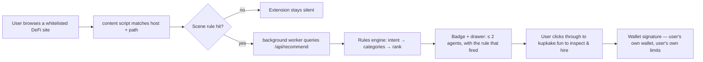

<p align="center">
  
</p>

<h1 align="center">Kupkake — Agents Where You Trade</h1>

<p align="center">
  <a href="https://kupkake.fun"><b>kupkake.fun</b></a> ·
  <a href="https://x.com/Kupkake_bsc">@Kupkake_bsc</a> ·
  BNB Smart Chain · ERC-8004 identity · ERC-8183 hiring
</p>

<p align="center">
  <i>Don't go shopping for agents. While you're on PancakeSwap, Venus, GMGN or four.meme,<br/>
  the right agent introduces itself — with a reason you can read, and a hire path you control.</i>
</p>

---

Kupkake flips agent discovery on BNB Chain: instead of users hunting through
4,000 registry entries on a leaderboard sorted by farmable trade counts,
**agents appear on the page where the user is already working** — recommended
by deterministic, explainable rules.

This repository contains the **open-source distribution layer** of Kupkake:

| Component | What it is |
|---|---|
| [`extension/`](extension/) | Chrome (Manifest V3) extension — the scene-distribution client |
| [`engine/`](engine/) | The rule-based recommendation engine + whitelist + data contracts (TypeScript) |
| [`docs/`](docs/) | Public API contract and the security model |

The marketplace web app (UI, hire flow, catalog admin) runs at
[kupkake.fun](https://kupkake.fun) and is not part of this repository — the
extension talks to it only through the small, documented API in
[`docs/API.md`](docs/API.md).

## How it works



**No LLM in the recommendation path.** Every recommendation is
`host + path → intent → categories → rank`, and the drawer shows the rule
that fired. Ranking is scene relevance, then verifiable track record —
never raw trade volume (that's farmable).

## Try the engine (no install, no network)

```bash
npx tsx engine/demo.ts pancakeswap.finance /swap
npx tsx engine/demo.ts app.venus.io /core-pool
npx tsx engine/demo.ts four.meme /
```

Example output:

```
scene   : You're building a swap on PancakeSwap.
intent  : swap  (rule: pcs-swap)
agents  : (max 2, ranked by scene relevance — never raw volume)
  • Slip Sifter — Routes big or awkward BSC swaps to minimize slippage and MEV surface.
    8004:56:0x2c77…a3f0 · hireable: true · categories: swap_safe
```

`engine/agents.ts` ships with a 4-agent sample (one per flagship scene) so the engine runs standalone;
the full curated catalog is served live by
[`https://kupkake.fun/api/agents`](https://kupkake.fun/api/agents).

## Install the extension

1. Download or clone this repo (or grab the zip from
   [kupkake.fun/install](https://kupkake.fun/install)).
2. Open `chrome://extensions`, enable **Developer mode**.
3. **Load unpacked** → select the `extension/` folder.
4. Visit PancakeSwap, Venus, GMGN, debot.ai or four.meme — the cupcake badge
   appears when (and only when) a scene rule matches.

The extension auto-syncs its whitelist from
[`/api/whitelist`](https://kupkake.fun/api/whitelist) and falls back to the
bundled [`extension/config.js`](extension/config.js) offline. It tries
production first and falls back to `localhost:9800` for local development.

## The trust boundary (what this code never does)

- **Never touches private keys** and never injects into wallet flows.
- **Never auto-signs, never simulates clicks** on the host page. It reads
  `location.host` + `location.pathname` — nothing else. No page scraping,
  no keystrokes, no tracking.
- **Never recommends off-whitelist.** Unknown site → the extension is inert.
- **Max 2 recommendations per page**, each with the rule that fired.
  No dark patterns, no spam.
- Hiring happens on kupkake.fun, in the user's own wallet, with permissions
  spelled out before any signature. The plugin recommends; **the user decides**.

Full model: [`docs/SECURITY.md`](docs/SECURITY.md)

## Repository layout

```
extension/          Chrome MV3 extension (load-unpacked ready)
  manifest.json     minimal permissions: storage + whitelisted hosts only
  background.js     whitelist sync + recommendation proxy (prod → localhost fallback)
  content.js        scene matching + badge/drawer UI injection
  content.css       drawer styling (yolk & ink design system)
  config.js         bundled fallback whitelist
engine/
  types.ts          Agent / Category / Intent / SceneRule / WhitelistSite contracts
  recommend.ts      the entire rules engine (~50 lines, auditable in one sitting)
  whitelist.ts      whitelisted sites + scene rules (P0/P1 tiers)
  categories.ts     11 agent categories, 4 hackathon mains
  agents.ts         4-agent sample of the curated catalog
  demo.ts           CLI demo
docs/
  API.md            the 4 public endpoints the extension consumes
  SECURITY.md       threat model & guarantees
```

## Built for

**BNB Chain Hackathon — The Smart Money Era: Build the Era**
(BNB Agent Studio Marketplace track). Agents are BSC-live, carry ERC-8004
identity, and are hireable via ERC-8183 jobs or documented Studio endpoints.

## License

[MIT](LICENSE) © 2026 Baoger
